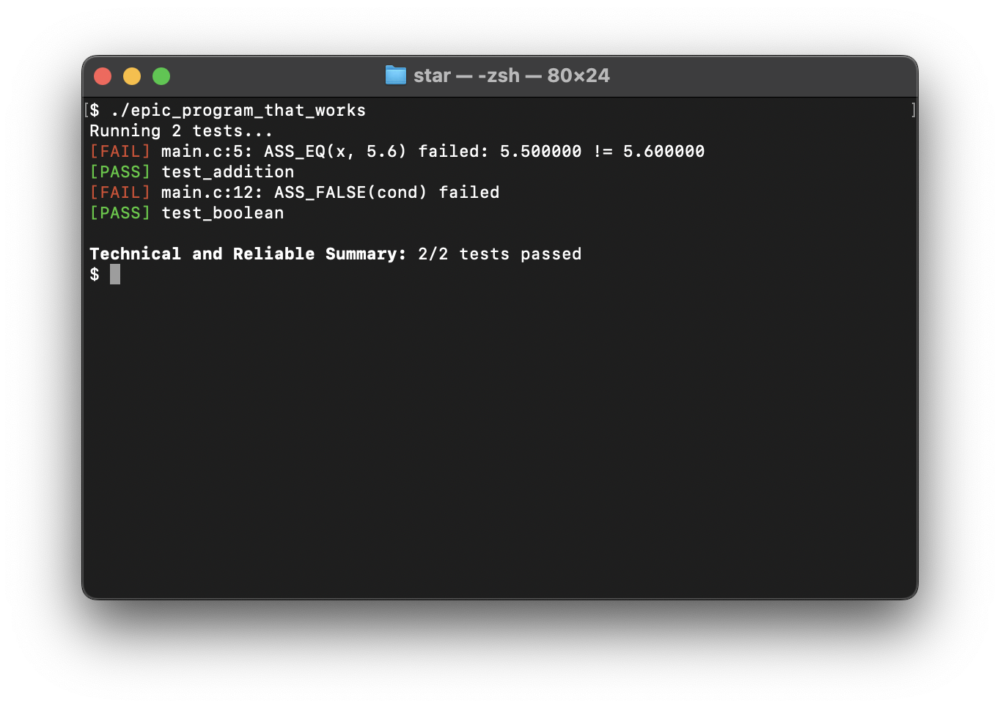

# star
STAR (Super Technical And Reliable) testing suite written in C.

> [!NOTE]
> I made this to be used in my personal C/C++ projects, it is very likely not as performant as many other testing suites out there, but I am ensuring in my development that it's easy to use.

## Current Functionality
### Tests and Asserts (still adding more)
Currently, 256 tests can be written.
#### Equality and Inequality
- `ASS_EQ(a, b)` / `ASS_NEQ(a, b)`
- `ASS_KINDAEQ(a, b, d)` / `ASS_KINDANEQ(a, b, d)` (Not/AlmostEqual functionality)

#### Boolean / Truthiness
- `ASS_TRUE(int cond)` 
- `ASS_FALSE(int cond)`

### Noncomprehensive Example
```c
#include "star.h"

TEST(test_addition) {
    float x = 2.2 + 3.3;
    ASS_EQ(x, 5.6);
    ASS_KINDANEQ(x, 12.6, NULL);  // difference defaulted to 6.9
}

TEST(test_boolean) {
    int cond = (10.2 > 10.13131);
    ASS_TRUE(cond);
    ASS_FALSE(cond);
}

// Automatic test case running by "hijacking" the `main()` function.
// Use #define STAR_NO_ENTRY *before* including `star.h` to disable this.
// Then use star_run(bool enable_output) to run all tests.
```
**Colored Output:**


### Dev Notes
- [ ] Object truthiness (struct, array, etc.)
- [ ] Need to consider epsilon-based floating-point comparison
- [ ] Parameterized testing
