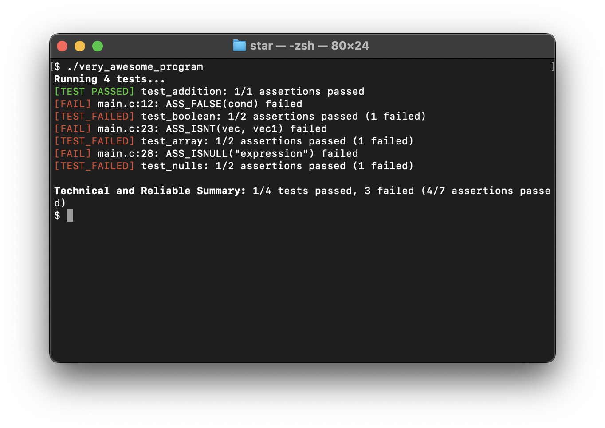

# star
STAR (Super Technical And Reliable) testing suite written in C.

> [!NOTE]
> I made this to be used in my personal C/C++ projects, it is very likely not as performant as many other testing suites out there, but I am ensuring in my development that it's easy to use.

## Current Functionality
### Tests and Asserts (developing more)
Currently, 256 tests can be written.
#### Equality and Inequality
- `ASS_EQ(a, b)` / `ASS_NEQ(a, b)` (compare `double`)
- `ASS_KINDAEQ(a, b, d)` / `ASS_KINDANEQ(a, b, d)` (Not/AlmostEqual functionality, difference defaulted to 6.9)

#### Boolean / Truthiness
- `ASS_TRUE(int cond)` / `ASS_FALSE(int cond)`
- `ASS_IS(expr)` / `ASS_ISNT(expr)` (Objects - structs, arrays, etc.)
- `ASS_ISNULL(expr)` / `ASS_ISNTNULL` (Null checker)

There is also support for custom messages by adding an `M` at the end of the function name: `ASS_EQM, ASS_KINDANEQM, ...`. An example of this is below.

### Noncomprehensive Example
```c
#include "star.h"

TEST(test_addition) {
    float x = 2.2 + 3.3;
    ASS_NEQM(x, 5.5, "wow who knew it was equal");
    ASS_KINDANEQ(x, 12.3, NULL);
}

TEST(test_boolean) {
    int cond = (10.2 > 10.13131);
    ASS_TRUE(cond);
    ASS_FALSE(cond);
}

typedef struct {
    float x, y, z;
} vec3;

TEST(test_array) {
    vec3 vec  = {4, 3, 1};
    vec3 vec1 = {4, 3, 1};
    ASS_IS(vec, vec1);
    ASS_ISNT(vec, vec1);
}

TEST(test_nulls) {
    ASS_ISNULL(NULL);
    ASS_ISNULL("expression");
}

TEST(test_strings) {
    ASS_STREQ("foo", "bar");
    ASS_STRNEQ("hello", "world!");
}

// Automatic test case running by "hijacking" the `main()` function.
// Use #define STAR_NO_ENTRY *before* including `star.h` to disable this.
// Then use star_run(bool extra_output) to run all tests.
```
**Colored Output:**
<!--  -->
<p align="center">
    
</p>

Only 8 asserts are recognised because of fatal assertions that abort the rest of the function and subsequently don't reach the next assert (in `test_strings` and `test_addition`).

### Macros
All the assertions are function-like macros, but there are a few others that, if you choose, should be defined before `#include`-ing the header:
- `STAR_NO_ENTRY`:  
    By default, STAR provides its own `int main(...)` entrypoint and automatically runs all tests (inspired by [sokol](https://github.com/floooh/sokol)).  
    Defining `STAR_NO_ENTRY` disables this behavior, requiring you to manually start test execution by calling `star_run(bool extra_output)`.  
    This option should be enabled for most applications, except when testing STAR itself or when creating minimal standalone unit-test examples.
- `STAR_NO_COLOR`:
    By default, STAR uses ASCII escape codes for coloring. Defining `STAR_NO_COLOR` disables this.
- `STAR_NON_FATAL`:
    `ASS_` functions are by default fatal and will abort the function they are written in. 
    Defining `STAR_NON_FATAL` disables this, and asserts are then treated similar to `EXPECT_` macros in other libraries.
    As [GoogleTest says]((https://google.github.io/googletest/primer.html#assertions)): these are usually preferred, so enable this whenever possible, as fatal asserts are only truly useful when continuing after failing is illogical.
- `STAR_VERBOSE` (or `STAR_VERBOSE_ASSERTS`):
    Passed asserts aren't outputted by default if any of the other asserts in the testcase fail, this is to reduce the chanced of a cluttered output. Enable this to show passed asserts.

### Dev Notes
- [x] More informative outputs
- [x] Object truthiness (struct, array, etc.)
- [x] Epsilon-based floating-point comparison
- [x] String comparing
- [x] Custom fail messages
- [ ] Collections / Sequences
- [ ] Parameterized testing
